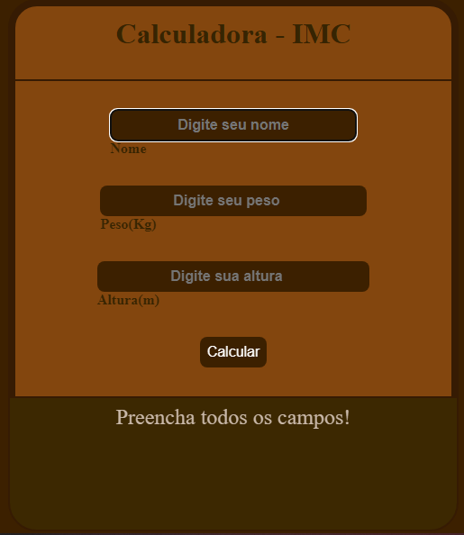
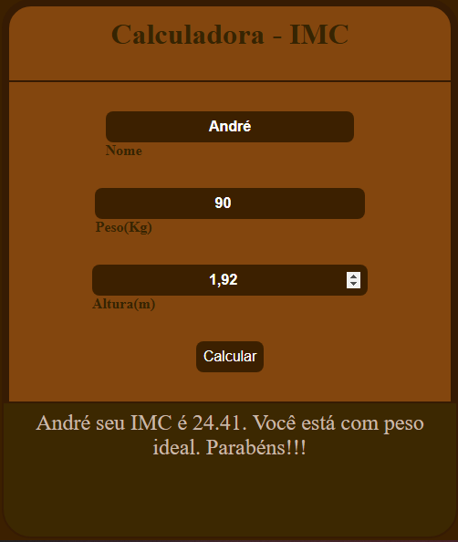

<h1 align="center"> Calculadora IMC </h1>

Programa exclusivo e gratuito.  
<a href="https://www.linkedin.com/in/andr%C3%A9-s-rolim-b8271b207/">Conheça mais sobre esse e outros projetos clicando aqui.</a>

  <a href="#-tecnologias">Tecnologias</a>&nbsp;&nbsp;&nbsp;|&nbsp;&nbsp;&nbsp;
  <a href="#-projeto">Projeto</a>&nbsp;&nbsp;&nbsp;|&nbsp;&nbsp;&nbsp;
  <a href="#-layout">Layout</a>&nbsp;&nbsp;&nbsp;

 

  
  

## 🚀 Tecnologias

Esse projeto foi desenvolvido com as seguintes tecnologias:

- HTML e CSS
- JavaScript
- Git e Github

## 💻 Projeto

A calculadora IMC é uma ferramenta para auxiliar na obtenção de seu indicie de massa corporal.

- [Acesse o projeto finalizado, online](https://andrerollim.github.io/Apresentacao-de-jogos/)

## :wave: Aprendizado

Neste projeto aprendi a utilizar o JavaScript para criar uma calculadora de IMC;
Utilização de variáveis;  
Utilização de funções;
Utilização de condicionais;
Utilização de eventos;
Estilização com CSS;

---

Feito com ♥ by André Rolim :wave: